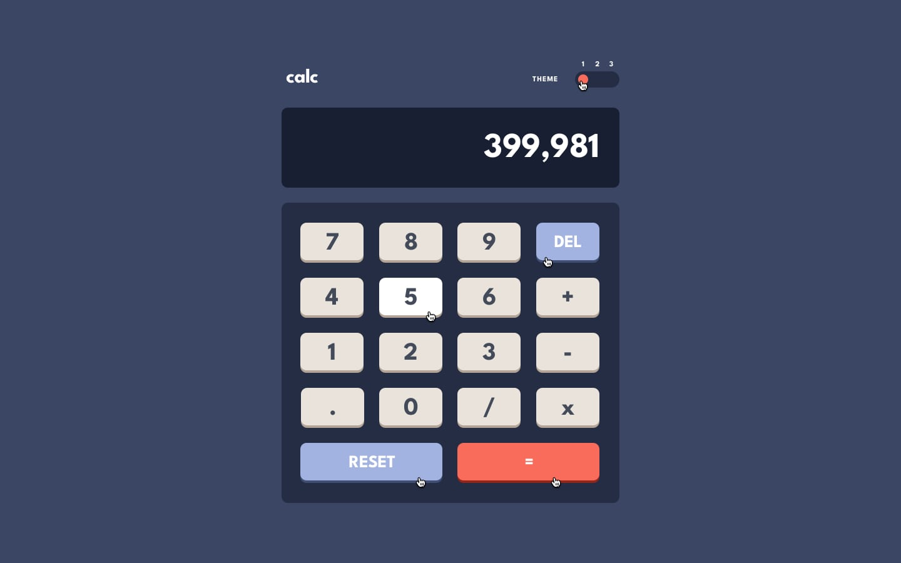
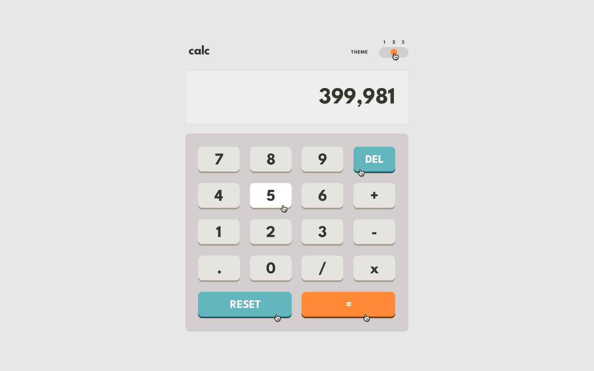
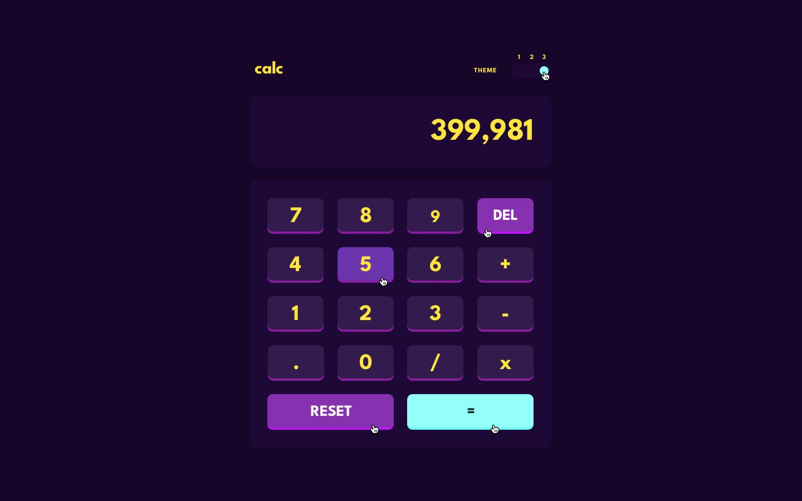

# 🧮 Multi-Theme Calculator App

A responsive, accessible, and feature-complete calculator web application built as part of the **Frontend Mentor** challenge. Features a custom **3-state theme switcher** powered by React Context, custom CSS grid layouts, and full **physical keyboard support**.

---

## 📸 Live Preview

  
  
  

---
## 🌟 Features

- 🎨 **3 Dynamic Color Themes:**
  - **Theme 1:** Classic Slate/Dark Blue
  - **Theme 2:** Crisp Light Gray
  - **Theme 3:** High-Contrast Neon/Purple
- ⌨️ **Physical Keyboard Controls:** Full typing support using digits, mathematical operators, `Backspace`, `Enter`, and `Escape`.
- 📱 **Fully Responsive Layout:** Optimized using CSS Grid and Tailwind CSS for mobile, tablet, and desktop viewports.
- 🔐 **Safe Calculation Engine:** Sanitized expression evaluation preventing crash cases, division by zero, or invalid syntax.
- ⚡ **Type-Safe State Management:** Managed via TypeScript and React's `useContext` / `createContext` API.

---

## 🛠️ Tech Stack

- **Frontend Library:** [React](https://react.dev/)
- **Type System:** [TypeScript](https://www.typescriptlang.org/)
- **Styling:** [Tailwind CSS](https://tailwindcss.com/)
- **Build Tool:** [Vite](https://vitejs.dev/)

---
